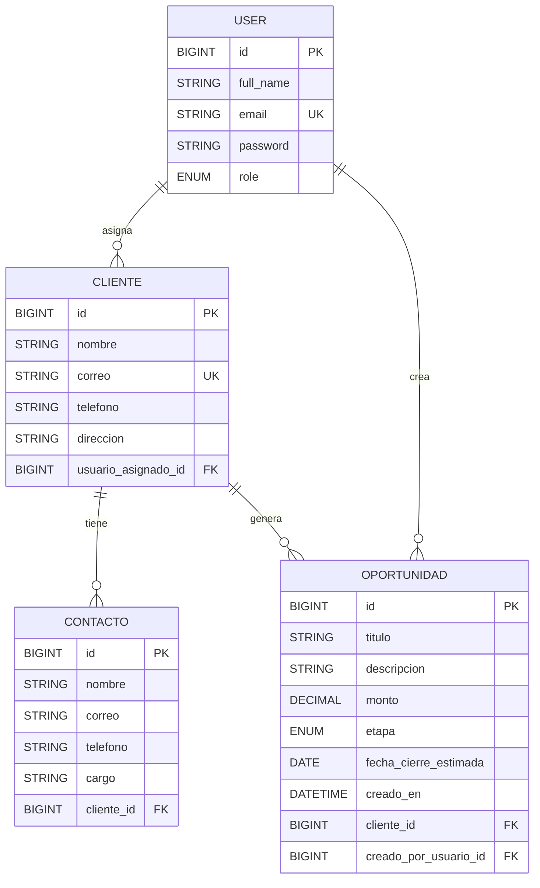

# parcial2 CRM

API REST con Spring Boot para la gestión de clientes, contactos, oportunidades y usuarios con autenticación JWT.

## Tecnologías
- Java 17+
- Spring Boot 4
- Spring Web MVC
- Spring Data JPA
- Spring Security 6
- JWT
- H2 Database
- Maven

## Estructura de paquetes
```text
com.example.parcial2
├── config
├── controller
├── dto
│   ├── request
│   └── response
├── entity
├── exception
│   ├── custom
│   └── handler
├── mapper
├── repository
├── security
├── service
└── service.impl
```

## Roles y acceso
- `ADMIN`: administra usuarios y puede eliminar clientes.
- `VENDEDOR`: crea y actualiza clientes, contactos y oportunidades.
- `LECTOR`: consulta clientes.

## Credenciales demo
Se crean automáticamente al iniciar la aplicación:

- **ADMIN**
  - email: `admin@crm.local`
  - password: `Admin123*`

- **VENDEDOR**
  - email: `vendedor@crm.local`
  - password: `Vendor123*`

- **LECTOR**
  - email: `lector@crm.local`
  - password: `Reader123*`

## Endpoints principales
### Auth
- `POST /auth/register`
- `POST /auth/login`

### Clientes
- `POST /clientes`
- `GET /clientes`
- `GET /clientes/{id}`
- `PUT /clientes/{id}`
- `DELETE /clientes/{id}`
- `POST /clientes/{id}/contactos`
- `POST /clientes/{id}/oportunidades`

## Seguridad
- API stateless con JWT.
- El token se envía en `Authorization: Bearer <token>`.
- Solo `ADMIN` puede eliminar clientes.

## Manejo de errores
- Las validaciones usan `@ControllerAdvice` para devolver errores estructurados.
- Los errores incluyen estado HTTP, mensaje, lista de detalles y ruta solicitada.

## Respuesta exitosa
```json
{
  "status": "success",
  "code": 200,
  "message": "Operación completada",
  "data": {},
  "timestamp": "2026-04-20T12:00:00Z"
}
```

## Respuesta de error
```json
{
  "status": "error",
  "code": 404,
  "message": "Cliente with id 99 not found",
  "errors": ["Cliente with id 99 not found"],
  "timestamp": "2026-04-20T12:00:00Z",
  "path": "/clientes/99"
}
```

## Diagrama ER


## Variables de entorno opcionales
Puedes definir:

```bash
APP_JWT_SECRET=tu_clave_base64
```

Si no la defines, el proyecto usa la configuración local de desarrollo.
## Preguntas a IA
refactoriza el anterior proyecto siguiendo las siguientes instrucciones:
Reglas base

Controlador no trabaja con entidades: recibe DTO de entrada y responde DTO de salida.
Controlador delega todo al servicio: no mete reglas de negocio ni acceso a BD.
Servicio concentra la lógica de negocio y validaciones de negocio (ejemplo: unicidad de usuario, formato de contraseña, roles permitidos).
Persistencia solo en repositorios Spring Data.
Conversión DTO ↔ entidad se hace con MapStruct (mappers dedicados), no manual en controlador.
Errores de negocio se lanzan como excepción de dominio y se resuelven globalmente con un manejador de excepciones.
Respuestas HTTP envueltas en ResponseEntity en controladores.
Seguridad JWT stateless: autenticación por token, sin sesión de servidor.
Reglas de autorización por método HTTP y rol:
POST/PUT/DELETE para ADMIN.
GET para USER y ADMIN.
Endpoints de auth públicos.
Reglas específicas de API

Endpoints de autenticación separados (signup/login).
Login devuelve DTO con token.
Signup ejecuta validaciones de negocio antes de guardar.
Errores tienen formato consistente (mensaje, status, path, timestamp, details) desde un manejador global.
Reglas de diseño de capas (muy importante para copiar el estilo)

Flujo estándar: Controller -> Service -> Repository.
DTO de request para entrada, DTO de response para salida.
Entidades solo para modelo de datos/JPA.
Relaciones JPA se definen en entidades (ejemplo: ManyToOne en Student hacia Course, Professor y Faculty).

DB en H2 console

Añadir README.MD donde se especifique paso a paso el sistema de negocio, los endpoints, coleciones para postman y   un Diagrama ER de todo el flujo de trabajo del proyecto.


